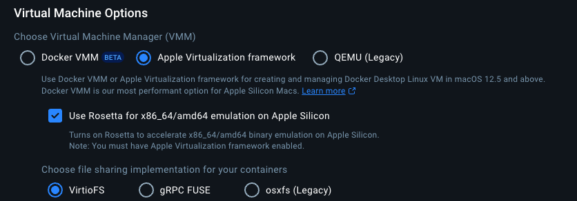
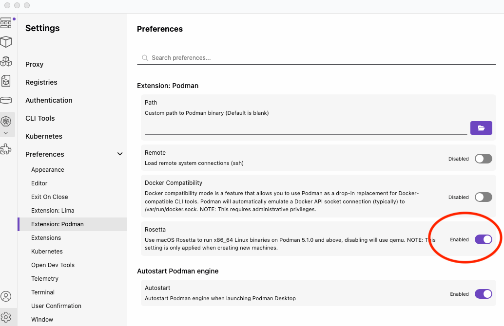

# familie-oppdrag
Generell proxy mot Oppdragsystemet (OS) for familie-ytelsene

## Bygging
Bygging gjøres med `mvn clean install`. 

## Swagger
http://localhost:8087/swagger-ui.html

## Oppsett for å kjøre Maven lokalt for nyere Mac'er med ARM(M1/M2) prosessorer
Det er ingen docker for ibmmq som er bygget for arm64. Man må dermed skru på Rosetta 2 emulering i ditt dockermiljø.
#### Rosetta for Colima
```
colima start --vm-type=vz --vz-rosetta
```
#### Rosetta for Docker Desktop


#### Rosetta for Podman


## Kjøring lokalt
#### Sett environment variabel
```
AZURE_APP_CLIENT_ID=<client id i familie-oppdrag i preprod>
```
### Kjøring der app'en starter containere for postgres og MQ
For å kjøre opp appen lokalt kan en kjøre `DevPsqlMqLauncher`, som har spring-profilen `dev_psql_mq` satt.
Appen vil starte containere for siste versjoner av PostgresSql og IBM MQ.

Appen tilgjengeliggjøres på `localhost:8087`.

### Kjøring med separate containere for postgres og MQ
For å kjøre opp appen lokalt kan en kjøre `DevLauncher`, som har spring-profilen `dev` satt.
Appen tilgjengeliggjøres på `localhost:8087`.

I tillegg må man kjøre opp en MQ-container med docker:
```
docker run \
  --env LICENSE=accept \
  --env MQ_QMGR_NAME=QM1 \
  --publish 1414:1414 \
  --publish 9443:9443 \
  --detach \
  ibmcom/mq
```

Og sette opp en database lokalt:
```
docker run --name familie-oppdrag -e POSTGRES_PASSWORD=test -d -p 5432:5432 postgres
docker ps (finn container id)
docker exec -it <container_id> bash
psql -U postgres
CREATE DATABASE "familie-oppdrag";
```

Les mer om postgres på nav [her](https://github.com/navikt/utvikling/blob/master/PostgreSQL.md). For å hente credentials manuelt, se [her](https://github.com/navikt/utvikling/blob/master/Vault.md). 

## Teste i preprod, f.eks Postman

Detaljer for å få access-token ligger [her](https://github.com/navikt/familie/blob/master/doc/utvikling/preprod/kalle_autentisert_api.md).

### Test med Postman
For å teste i postman kan du prøve med følgende verdier:

* Http-metode: `POST`<br/>
* Url: `https://familie-oppdrag.nais.preprod.local/api/status`<br/>
* Headers:
  * Authorization: `Bearer <access_token>`
  * Content-Type: `application/json`
* Body: `{ "fagsystem": "A","personIdent": "B","behandlingsId": "1"}`

Du bør få et 404-svar som ser slik ut:
```
{
    "data": null,
    "status": "FEILET",
    "melding": "Fant ikke oppdrag med id OppdragId(fagsystem=A, behandlingsId=1)",
    "stacktrace": null
}
```

## Kikke på database i preprod
Detaljer ligger [her](https://github.com/navikt/familie/blob/master/doc/utvikling/preprod/kikke_i_databasen)

Databasen heter `familie-oppdrag` og i skrivende stund er IP-adressen til serveren `10.183.160.86


#### Test token i q2
I q2 er det mulig å hente ut azure test tokens fra azure-token-generator:
client credential: https://azure-token-generator.intern.dev.nav.no/api/m2m?aud=dev-fss.teamfamilie.familie-oppdrag
on-behalf-of: https://azure-token-generator.intern.dev.nav.no/api/obo?aud=dev-fss.teamfamilie.familie-oppdrag


## Kontaktinfo
For NAV-interne kan henvendelser om appen rettes til #team-familie på slack. Ellers kan man opprette et issue her på github.
